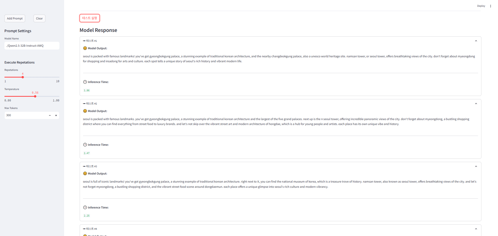
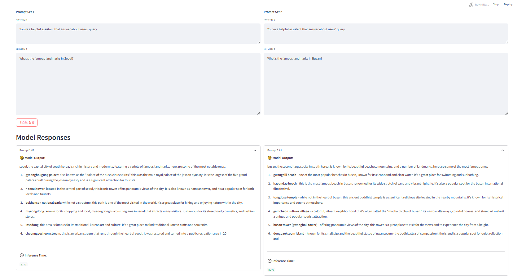

# 🎯 Prompt Tester

A local LLM prompt testing tool inspired by LangSmith Prompter Test.
<br>
Built with Streamlit, this tool allows you to compare two different prompt versions or test a single prompt multiple times.

## ✨ Features

- 📝 Support for single/double prompt testing
- 🔄 Separate system and human prompt inputs
- 🔁 Multiple test iterations (up to 10)
- 🌡️ Adjustable temperature (0.0-1.0)
- ⏱️ Inference time measurement
- 💾 Prompt save and reset functionality
- 🎈 You can know about the inference time and the result of the prompt with model's thinking process.

## 🎮 Demo

This tool works with any OpenAI API-compatible LLM server (e.g., sglang, VLLM).

### 🔍 Test Single Prompt



- Test with a single prompt set
- Input system and human prompts
- Run multiple iterations

### 🔄 Test Double Prompt



- Compare two different prompt sets side by side
- View results simultaneously
- Compare inference times

## 🚀 Installation & Usage

1. Install requirements

```bash
pip install -r requirements.txt
```

2. Configure environment

- Create `.env` file with:
  ```
  BASE_URL=your_llm_server_url
  API_KEY=your_api_key
  ```

3. Run the application

```bash
streamlit run prompt_tester.py
```

4. Access the web interface

```
http://localhost:8501
```

## 📋 Requirements

- Python 3.8+
- OpenAI API compatible LLM server
- Streamlit
- python-dotenv
- openai

## 📝 Notes

- 🔌 Compatible with OpenAI API format LLM servers
- 🤖 Default model: "./Qwen2.5-32B-Instruct-AWQ"
- 🎚️ Default temperature: 0.56
- 📊 Max tokens: 300
